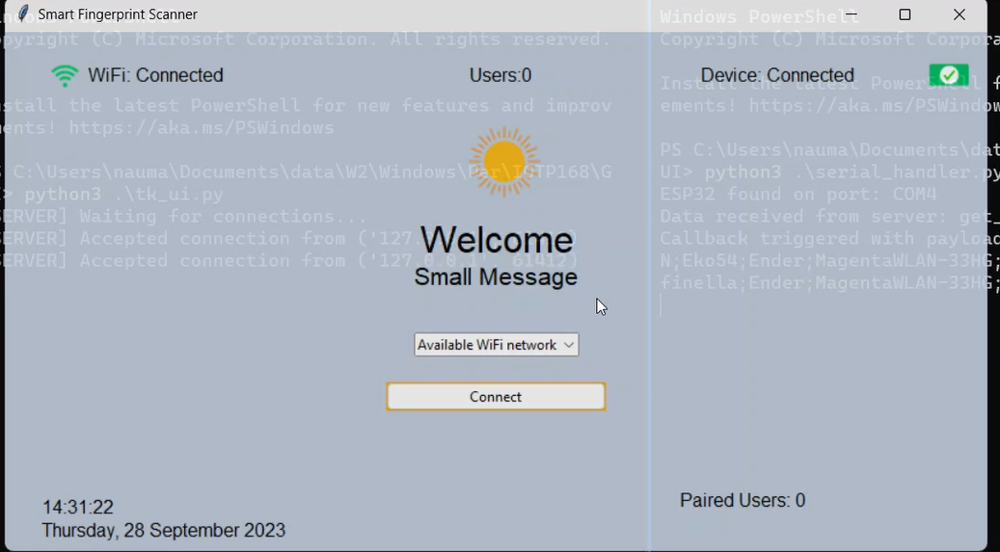
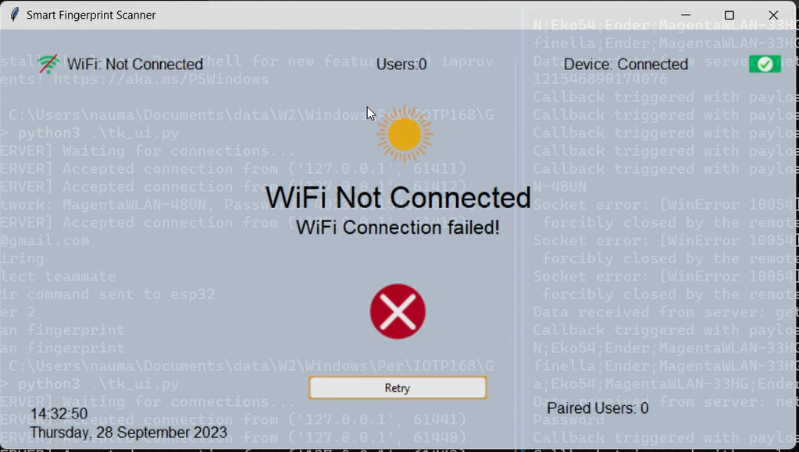

<p align="center">
  <a href="" rel="noopener">
 </a>
</p>

<h3 align="center">Smart Fingerprint Sensor</h3>

<div align="center">

[]()


</div>

---


<p align="center"> Smart Fingerprint Sensor
    <br> 
</p>

## 📝 Table of Contents

- [About](#about)
- [Getting Started](#getting_started)
- [Circuit](#circuit)
- [Usage](#usage)
- [WebApp](#webapp)
- [SmartphoneApp](#smartphoneapp)
- [Built Using](#built_using)
- [Authors](#authors)


## 🧐 About <a name = "about"></a>

This repo contains

- Firmware
- Circuit Diagram
- Detailed instructions

for Smart Fingerprint Sensor.


*High-level diagram of the system*

## Getting Started <a name = "getting_started"></a>

These instructions will get you a copy of the project up and running on your system.


### Prerequisites

Things you need to install the FW.

```
- Arduino IDE
```

### Installing <a name = "installing"></a>

A step by step series that tell you how to get the Firmware and Backend running

#### ESP32 Configuration

You should have Arduino IDE Installed

  1.  Add ESP32 Board to your Arduino IDE
    1. In your Arduino IDE, go to File> Preferences
        Installing ESP32 Add-on in Arduino IDE Windows, Mac OS X, Linux open preferences
    2. Enter ```https://dl.espressif.com/dl/package_esp32_index.json``` 
        into the “Additional Board Manager URLs” field then, click the “OK” button:
        Note: if you already have the ESP32 boards URL, you can separate the URLs with a comma(each board will go to neaw line) as follows:
        ```https://dl.espressif.com/dl/package_esp32_index.json,\n http://arduino.esp8266.com/stable/package_esp8266com_index.json```
    
    
  2. Open the Boards Manager. Go to Tools > Board > Boards Manager…
  3. Search for ESP32 and press install button for the ESP32 by Espressif Systems“:
  4. That’s it. It should be installed after a few seconds.
  5.   In your Arduino sketchbook directory, create tools directory if it doesn't exist yet.
  6.  Unpack the tool into tools directory(present in libs/ESP32FS-1.0.zip) (the path will look like <home_dir>/Arduino/tools/ESP32FS/tool/esp32fs.jar).
  7.  Close and re-open the Arduino IDE.

  8.  Now copy the contents of the libs folder to the libraries directory of your Arduino
      1. If you are using windows, the libraries directory will be Documents/Arduino/libraries

##### ESP32 Node FW Uploading
  1.  Select ESP32 Dev Module from Tools->Board->ESP32
  2.  Select the correct port from Tools->Port
  3.  Then open Firmware.ino file,
  4.  Select Tools > ESP32 Sketch Data Upload menu item. This should start uploading the files into ESP32 flash file system.
  5.  Now Upload the Code to your ESP32 Dev Module.
  6.  Your ESP32 is now ready to be used.


## Circuit <a name = "circuit"></a>


### ESP32 Dev Module Pinout


Follow the pinout diagram given below to connect different components to your ESP32 board.


### Circuit Diagram for Smart Fingerprint Sensor

Here's the complete circuit diagram of the system.


### Components Connections

```http
Other components pin connection details
```


#### Status LEDs

```LED Connections with ESP32```

| LED Pins | ESP32 Dev Module Pins| 
| :--- | :--- | 
| `Green LED +` | `D27` OR `G27` |
| `Yellow LED +` | `D33` OR `G33`|
| `Red LED +` | `D32`  OR `G32` |

The negative pins of each LED will be connected to `GND` via 330Ohm Resistor.

#### PAM8302A

```PAM8302A Connections with ESP32```

| PAM8302A Pins | ESP32 Dev Module Pins| 
| :--- | :--- | 
| `A+` | `D25` OR `G25` |
| `A-` | `GND` |
| `SD` | `D14` OR `G14` |
| `VIN` | `3.3V` |
| `GND` | `GND` |


#### AS608 Fingerprint Scanner

```AS608 Connections```

| AS608 Pins | ESP32 Dev Module | 
| :--- | :--- | 
| `V+` | `3.3V` |
| `GND` | `GND` |
| `TX` | `RX2` OR `G16`|
| `RX` | `TX2` OR  `G17` |


#### SSD1351 OLED

```SSD1351 Connections```

| SSD1351 Pins | ESP32 Dev Module | 
| :--- | :--- | 
| `VCC` | `VIN` OR `V5` |
| `GND` | `GND` |
| `RST` OR `RES` | `D19` OR `G19` |
| `DC` | `D4` OR `G4` |
| `CS` | `D5` OR `G5` |
| `CLK` OR `SCL` | `D18` OR `G18`|
| `DIN` OR `SDA` | `D23` OR `G23` |

## Usage <a name = "usage"></a>

```diff
! Ready for testing
```
1.  Power on your ESP32.
2. Connect it to your laptop via USB cable
3. Open the Dashboard using following
```bash
cd GUI
pip3 install -r requirements.txt
python3 tk_ui.py
python3 serial_handler.py
```

### One-Click Installer

You will need to run the following command in order to install or update the SmartFingerprintScanner:

```bash
wget -O - https://raw.githubusercontent.com/Nauman3S/SmartFingerprintScanner/main/installer.sh | bash
```

on macOS

```bash
curl -sSL https://raw.githubusercontent.com/Nauman3S/SmartFingerprintScanner/main/installer.sh | bash
```

```diff
If macOS installer don't work, run the following commands and again run the One-Click Installer for macOS
```
```bash
rm -rf ~/SmartFS
```

### One-click Run

1.  The program can be run using the following command
```bash
cd ~/SmartFPS
./run.sh
```

2. To test new GUI Version 2, execute the following command
```bash
cd ~/SmartFPS
./run.sh v2
```

### API Endpoints and HTML URLS

```API Endpoints```

| Endpoint | Description | 
| :--- | :--- | 
| `/user_count` | `user count` |


### Dashboard Screenshots
**Main Screen**

**WiFi Networks Selection**

**WiFi Connected**

**Connected to backend via email address**

**Fingerprint scanning**

**Teammate added**

**WiFi not connected and device disconnected errors**


## List of Components <a name = "list"></a>

Following components are used to make this project

1.  ESP32 Dev Kit Module
2.  PAM8302
3.  Speaker
4. Red, Green, Yellow LEDs
5. 330Ohm Resistors
6. AS608 Fingerprint Sensor
7. SSD1351 OLED


## ⛏️ Built Using <a name = "built_using"></a>

- [Arduino](https://www.arduino.cc/) - Embedded Framework and IDE - For Sensor Node Design

## 📹 Demo Videos <a name = "demo"></a>
```diff
+ For future use
```
<!-- -   [Device Demo Video]() - Smart Fingerprint Sensors Device Demo Video -->

## ✍️ Authors <a name = "authors"></a>

- [@Nauman3S](https://github.com/Nauman3S) - Development and Deployment
